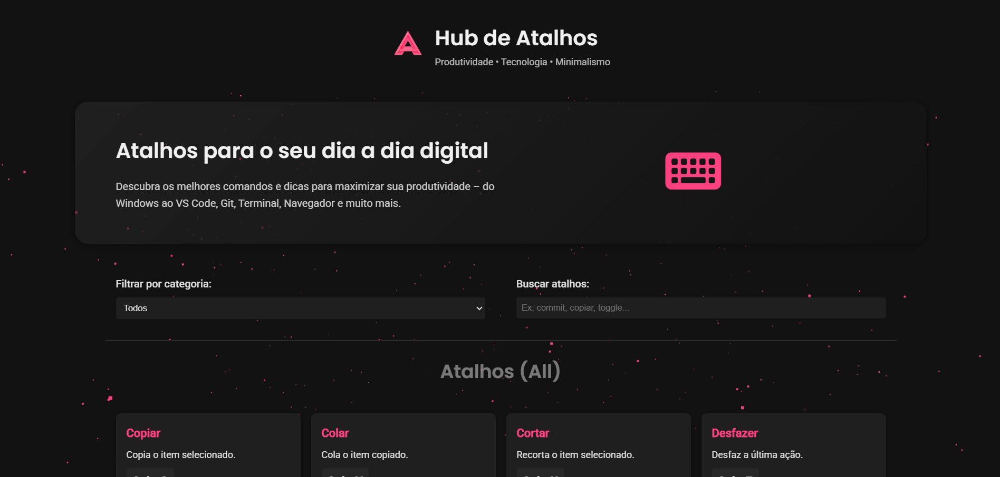
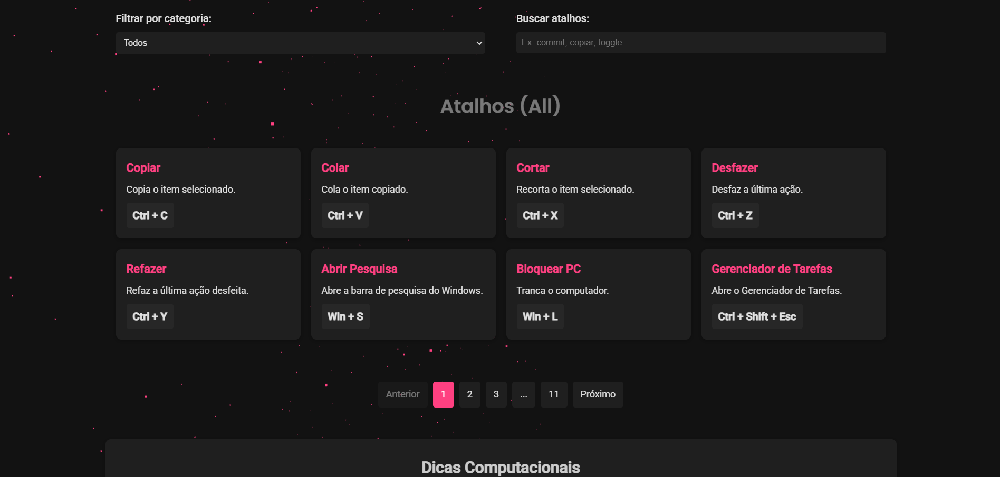
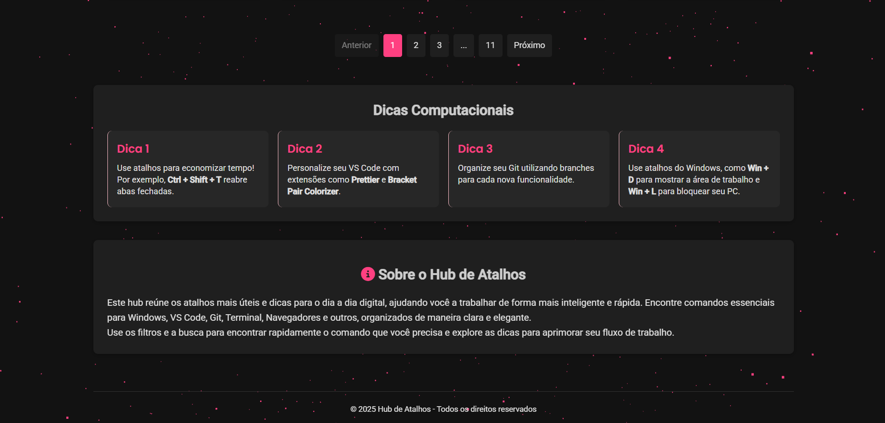

# Hub de Atalhos

Hub de Atalhos é uma aplicação front-end moderna e tecnológica, desenvolvida para reunir os atalhos mais úteis para o dia a dia digital. Com um design dark e interativo, o projeto oferece funcionalidades como filtragem, busca e paginação inteligente, além de um fundo animado 3D criado com Three.js para dar um toque futurista.

## Funcionalidades

- **Design Dark Mode e Futurista:**  
  Interface minimalista e tecnológica com um fundo animado 3D (starfield) usando Three.js.

- **Filtros e Busca:**  
  Permite filtrar atalhos por categoria (Computador, VS Code, Git, Terminal, Navegador, Outros) e buscar por palavras-chave.

- **Paginação Inteligente:**  
  Exibe 8 atalhos por página, organizados em 4 colunas em telas maiores, com botões de paginação limitados a 5 visíveis (com reticências para indicar páginas ocultas).

- **Seção de Dicas Computacionais:**  
  Pequenos cards com dicas úteis para acelerar o fluxo de trabalho e melhorar a produtividade.

- **Animações e Microinterações:**  
  Efeitos de fade-in, transições suaves e animações em cascade para os cards e controles, enriquecendo a experiência do usuário.

## Tecnologias Utilizadas

- **HTML5** e **CSS3** (com Flexbox e CSS Grid)
- **JavaScript** (Vanilla)
- **Three.js** para o fundo 3D animado (starfield)

## Capturas de Tela

### Visual Geral

--

--


---

## Como Executar o Projeto

1. **Clone o repositório:**
   ```bash
   git clone https://github.com/inojoza28/Atalhos.git
   cd hub-de-atalhos
